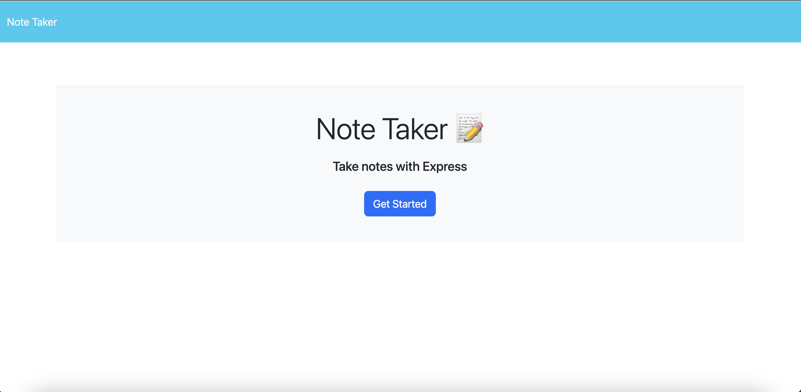
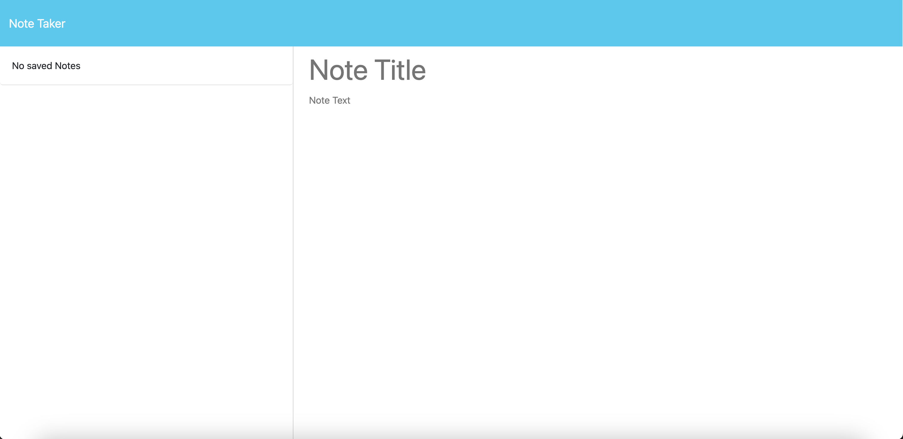
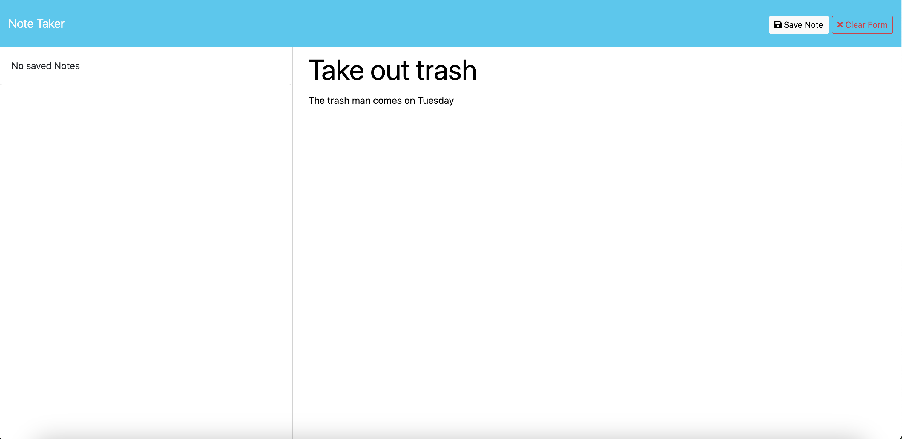
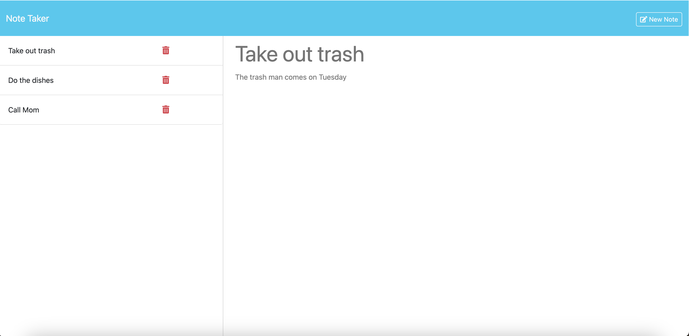

# Note Taker
This webpage allows users to take notes and display previous notes for whatever the user would like to write about. Also, notes can be deleted whent he user is done with them.
 
## Table of Contents
* [Installation](#installation)
* [Usage](#usage)
* [License](#license)
* [Contributing](#contributing)
* [Tests](#tests)
* [Questions](#questions)
 
## Installation
Install the required dependencies with 
```bash
npm install
```

To run the server locally, run

```bash
npm run start
```

## Usage
When running the server locally, open your browser to [1[localhost:3001](localhost:3001)]

You will be greeted by a landing page that should look like this:



When the user clicks the "get started" button, they will be navigated to the page that will allow the user to write and display any previously saved notes The page will look like this when no note have been saved to the database:



The user may type in a title for the note that they would like to take and then some text for the note itself. Once the user has finished typing their note, they can click the "save note" button that appears at the top. The page will look like this when a note is ready to be saved:



All notes that the user saves will be displayed on the left hand side of the screen. If the user clicks the title of one of the notes, the note title and text will appear on the right. If the user wants the option to type a new note, they can click the "New Note" button in the top right hand corner. The page will look like this when displaying a previously saved note:



If the user wants to delete the note, they can click the red trashcan button next to the note that they want to delete, and the note will be deleted from the database and the display of notes will remove the selected note.
 
## License
[](https://opensource.org/licenses/MIT)

MIT License

Copyright (c) 2024 Ethan Robert Owens

Permission is hereby granted, free of charge, to any person obtaining a copy
of this software and associated documentation files (the "Software"), to deal
in the Software without restriction, including without limitation the rights
to use, copy, modify, merge, publish, distribute, sublicense, and/or sell
copies of the Software, and to permit persons to whom the Software is
furnished to do so, subject to the following conditions:

The above copyright notice and this permission notice shall be included in all
copies or substantial portions of the Software.

THE SOFTWARE IS PROVIDED "AS IS", WITHOUT WARRANTY OF ANY KIND, EXPRESS OR
IMPLIED, INCLUDING BUT NOT LIMITED TO THE WARRANTIES OF MERCHANTABILITY,
FITNESS FOR A PARTICULAR PURPOSE AND NONINFRINGEMENT. IN NO EVENT SHALL THE
AUTHORS OR COPYRIGHT HOLDERS BE LIABLE FOR ANY CLAIM, DAMAGES OR OTHER
LIABILITY, WHETHER IN AN ACTION OF CONTRACT, TORT OR OTHERWISE, ARISING FROM,
OUT OF OR IN CONNECTION WITH THE SOFTWARE OR THE USE OR OTHER DEALINGS IN THE
SOFTWARE.
 
## Contributing
If you wish to contribute, fork the repository and make your edits. Send me an email or message me on Github (both are displayed below) with any of your suggested changes!
 
## Tests
No tests available for this application.
 
## Questions
* GitHub: [@Teacher2Coder](https://www.github.com/Teacher2Coder)
* Email: ethan.owens4@gmail.com